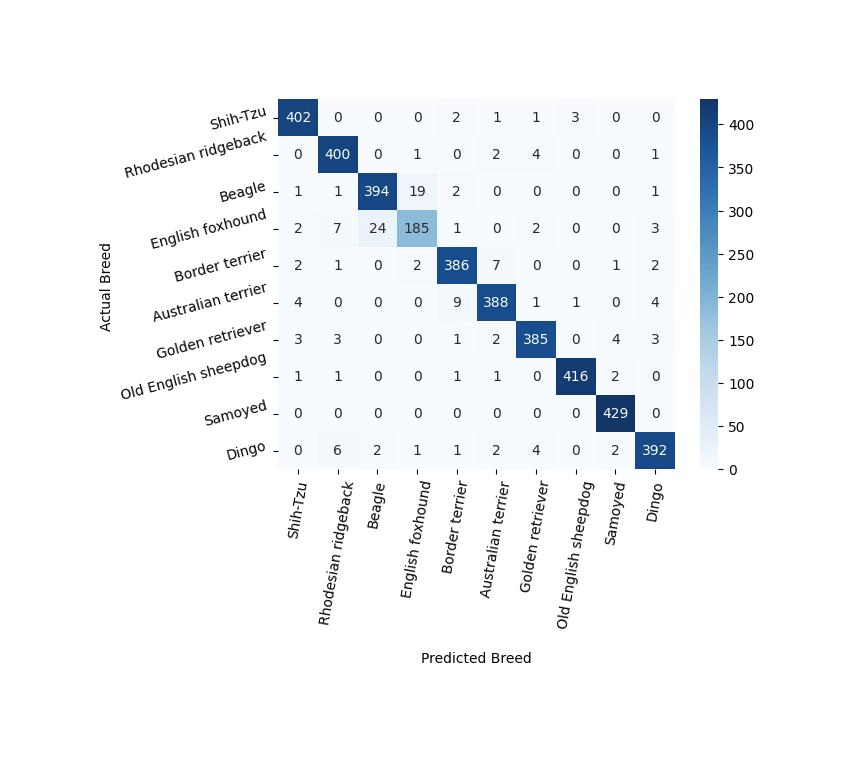

#Тестовое задание по CV.

###1.Реализовать свой пайплан CV классификации изображений
Используется датасет: [Imagewoof](https://github.com/fastai/imagenette)

####Базовый пайплайн

Базовый пайплайн представляет из себя дообучение предобученной на ImageNet сверточной сети. Имлементация находится в соотвествующей [ветке](https://github.com/Stasiche/SberCVDS/tree/training).
Выбран такой подход, потому что датасет представляет из себя подвыбоку из ImageNet, а сверточные сети хорошо зарекомендовали себя в задачах классификации изображений. 
Проведя разведочный анализ, стало понятно, что датасет сбалансирован и не очень велик. Также дополнительные условия задания 
подразумевают необходимость развертывания сервиса и бота. То есть быстродействию также следует уделить внимние.
Определив ограничения, я [проверил](https://pytorch.org/vision/stable/models.html) какие модели сейчас популярны и дают хороший результат. Перспективными для работы показалось семейство EfficientNet (по моему опыту, одно из самых сбалансированных семейств моделей) и СonvNext (в виду хороших результатов).
Первые попытки обучить показали, что даже самая маленькая EfficientNet-B0 получает хороший результат (около 90% доли правильных ответов), при этом она легкая и быстрая.
СonvNext-tiny напротив хоть и давала лучший результат (около 96% доли правильных ответов), обучалась в разы дольше.
Так как помимо качества, все-таки хотелось добиться легкости и возможности сети обрабатывать много запросов в секунду (RequestsPerSecond метрика), то я решил попробовать улучшить результаты EfficientNet семейства.
Лобовая гипероптимизация параметров из-за небольших техническо-временных ресурсов показалась непереспективной (да и честно говоря не такой интеерсной). 
Поэтому паралельно с тюнингом параметров было решено попробовать три подхода.
####Дополнительные пайплайны обучнеия

1) Self-supervised learning с использованием Barlow Twins. Последующее обучение на датасете
2) Одновременное обучение с Barlow Twins лоссом и обычной supervised кроссэнтропией
3) Дистилляция больших моделей на маленькие.
К сожалению, ни один из них не дал принципиального улучшения метрик. Скорее всего это опять связано с необходимостью более аккуратно найти оптимальные параметры.

####Резульаты
Замер результатов происходил по 100 изображений на Intel(R) Core(TM) i5-10400 CPU @ 2.90GHz.
Так как результаты по доле правильных ответов близки, то резульаты отсортированы по убыва rps как второй по значимости метрики.

|model_name|parameters_number(M)         |model_size(MB)|accuracy                                     |time(s)|rps  |
|----------|-----------------------------|--------------|---------------------------------------------|-------|-----|
|efficientnet_b4|17.6                         |71.0          |0.96                                         |399.0  |0.1  |
|efficientnet_b3|10.7                         |43.4          |0.957                                        |303.0  |0.132|
|convnext_tiny|27.8                         |111.4         |0.9613                                       |300.0  |0.133|
|efficientnet_b2|7.7                          |31.3          |0.9532                                       |221.0  |0.181|
|efficientnet_b1|6.5                          |26.5          |0.9537                                       |220.0  |0.182|
|efficientnet_b0|4.0                          |16.4          |0.9473                                       |161.0  |0.249|

Подробнее о допущеных ошибках (изображения, на которых допускались ошибки и матрицы ошибок) можно посмотреть в соотвествующей  [папке](https://github.com/Stasiche/SberCVDS/tree/training_analyse/errors)
Матрицы ошибок в целом выглядят похоже (матрица для convnext_tiny):

Можно заметить три факта:
1) Сети путают Английских фоксхаундов и Биглей 
2) Сети путают Бордер терьеров и Австралийский терьеров
3) Динго немного путают со всеми
Если первые два пункта понятны -- породы и правда очень похожи, то про Динго пришлось проанализоровать глубже. Проблемы с ними, на мой взгляд сконцентрированы в следующих вещах: они не имеют ярко выраженных особенностей (типа шерсти Самоедов или раскраски Биглей), а так же их меньше в датасете и в целом качество изображений куда хуже.

###2.Создать сервис на Flask, который может классифицировать картинки собак
Сервис [создан](https://github.com/Stasiche/SberCVDS/tree/flask_application) и упакован в докер

###3.Создать телеграм бота для классификации собак
Бот создан и развернут на хероку. @BreedRecognizerBot